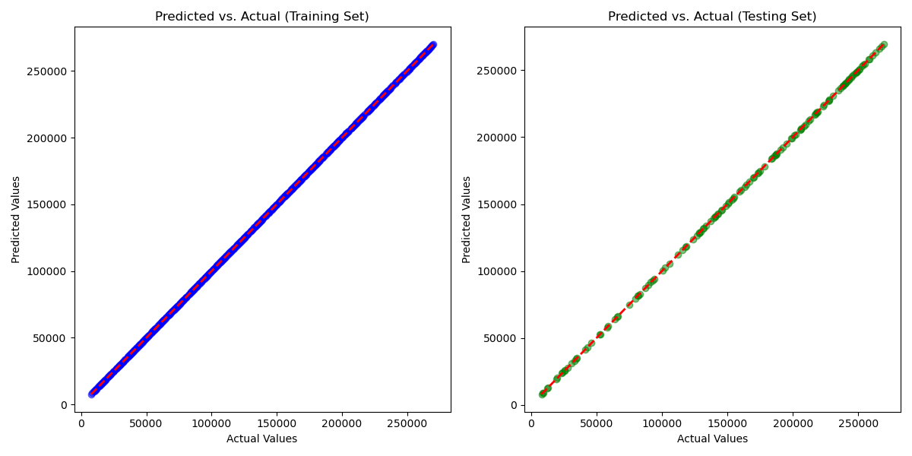
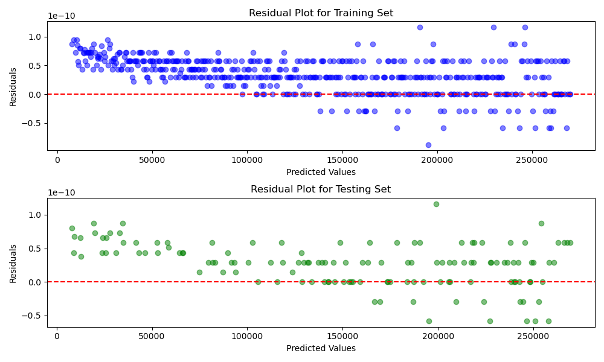

# Electrochemical Parameter Evolution Modeling

This project models and predicts the evolution of key electrochemical parameters (such as Rb, the bulk resistance) over time using polynomial regression. The workflow is implemented in Jupyter notebooks and visualized with several diagnostic plots.

## Project Overview

The goal is to simulate and analyze how electrochemical parameters change over a 28-day period, using synthetic data generated from initial and final experimental values. A polynomial regression model is trained to predict the bulk resistance (Rb) based on other parameters, and its performance is evaluated and visualized.

## Data Description

- **cepmod.csv**: Contains per-hour values for 28 days (672 hours) for the following parameters:
  - `CPEpor_F`, `CPEpor_n`, `Rpor`, `CPEb_F`, `CPEb_n`, and `Rb` (target)
  - Data is linearly interpolated between initial (1 hour) and final (28 days) experimental values.

## Workflow (real_cp.ipynb)

1. **Data Generation**: Synthetic time-series data is generated and saved to `cepmod.csv`.
2. **Data Loading**: The CSV is loaded into a pandas DataFrame.
3. **Feature Selection**: Predictors are selected (`CPEpor_F`, `CPEpor_n`, `Rpor`, `CPEb_F`, `CPEb_n`), with `Rb` as the target.
4. **Polynomial Regression**: A degree-2 polynomial regression model is fit using scikit-learn.
5. **Train/Test Split**: Data is split 80/20 for training and testing.
6. **Evaluation**: Model predictions are compared to actual values using regression metrics.
7. **Visualization**: Diagnostic plots are generated and saved.

## Plots and Their Interpretation

### 1. Predicted vs. Actual Plot 

- **Concept**: This scatter plot compares the predicted Rb values to the actual Rb values for both the training and testing sets.
- **Interpretation**: Points close to the diagonal (red dashed line) indicate accurate predictions. A tight cluster along the line means the model is performing well. Systematic deviations or spread indicate bias or variance issues.

### 2. Residual Plots 

- **Concept**: These plots show the residuals (errors: actual - predicted) versus the predicted values for both training and testing sets.
- **Interpretation**: Ideally, residuals should be randomly scattered around zero, indicating no systematic error. Patterns (e.g., funnel shapes or curves) suggest model misspecification or heteroscedasticity.

## Regression Metrics

The following metrics are printed for both training and testing sets:
- **R² (Coefficient of Determination)**: Proportion of variance in Rb explained by the model. Closer to 1 is better.
- **MAE (Mean Absolute Error)**: Average absolute difference between predicted and actual Rb.
- **MSE (Mean Squared Error)**: Average squared difference; penalizes larger errors.
- **RMSE (Root Mean Squared Error)**: Square root of MSE; interpretable in the same units as Rb.

**Interpretation**: High R² and low MAE/RMSE indicate a good fit. If test metrics are much worse than train metrics, the model may be overfitting.

## Results Interpretation

The regression model achieves perfect performance on both the training and testing sets, as indicated by the following metrics:
- **R² = 1.0000**: The model explains 100% of the variance in the target variable (Rb). Predictions match the actual values exactly.
- **MAE, MSE, RMSE = 0.0000**: There is no error between predicted and actual values.

**What does this mean?**
- For this dataset: The model fits the data perfectly. This is possible because the data is synthetic, generated from a deterministic process without noise or randomness. The relationships between features and the target are exactly captured by the polynomial regression model.
- On the plots: The Predicted vs. Actual plot shows all points lying exactly on the diagonal, and the residual plots show all residuals as zero.
- In practice: Such perfect results are extremely rare with real experimental data, which usually contains noise, measurement error, and more complex relationships. In real-world scenarios, you would expect R² to be less than 1 and error metrics to be greater than zero.

**Conclusion:**
- The model and workflow are validated for this synthetic scenario.
- For real experimental data, similar methods can be applied, but results will likely be less perfect due to data imperfections.
- The current results demonstrate that the code and approach are correct and ready for application to more complex or real datasets.

## How to Run

1. Install dependencies:
   ```bash
   pip install numpy pandas scikit-learn matplotlib
   ```
2. Open `real_cp.ipynb` in Jupyter Notebook or JupyterLab.
3. Run all cells. This will:
   - Generate `cepmod.csv`
   - Fit the regression model
   - Print metrics
   - Save plots as `act_v_pred.png` and `residual_plots.png`

## Dependencies
- Python 3.x
- numpy
- pandas
- scikit-learn
- matplotlib

## Context
This project is relevant for modeling the time evolution of electrochemical parameters, such as in corrosion science or materials research, where understanding resistance and capacitance changes over time is important.

## Repository Structure
- `real_cp.ipynb`: Main notebook for data generation, modeling, and analysis.
- `cepmod.csv`: Generated synthetic dataset (per-hour values for 28 days).
- `act_v_pred.png`: Predicted vs. actual Rb plot.
- `residual_plots.png`: Residual plots for model diagnostics.
- `.gitignore`: Excludes data, images, and environment files from version control.

## Notes
- All plots are saved in the project root for easy inclusion in reports or the README.
- For best results, ensure all dependencies are installed and run the notebook from start to finish.

---
For questions or contributions, please open an issue or pull request.
